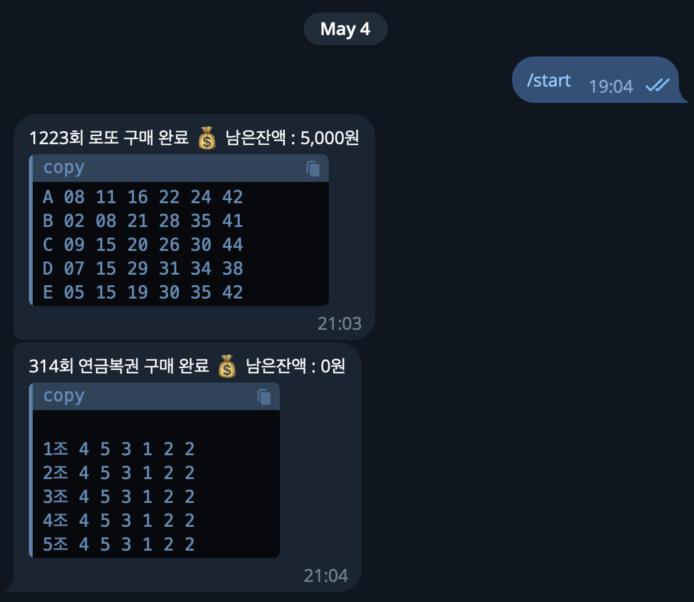

# 소개

동행복권 사이트내에 계정에 예치금만 넣어두시면 이후 매주 로또와 연금복권을 구입하고 당첨을 체크하여 알려드려요!

- 🗓️ **구매**: 매주 수요일 09:00 KST 자동 실행
- 🎯 **당첨 확인**: 매주 토요일 22:00 KST 자동 실행
- 📣 **알림**: Discord, Slack, Telegram 지원 (복수 채널 동시 발송 가능)

# 사용법

1. 레포지토리를 `fork` 합니다.
2. Settings → Secrets and variables → Actions 에서 아래 환경 변수를 등록합니다.
3. 동행복권 계정에 예치금 5,000원 이상 충전합니다.
4. Actions 탭에서 `Buy lotto` → **Run workflow** 로 수동 1회 테스트합니다.

# 환경 변수

| 변수명 | 필수 | 설명 |
|--------|------|------|
| `USERNAME` | ✅ | 동행복권 아이디 |
| `PASSWORD` | ✅ | 동행복권 비밀번호 |
| `COUNT` | ✅ | 로또645 구매 장수 (1~50) |
| `DISCORD_WEBHOOK_URL` | 선택 | Discord Webhook URL |
| `SLACK_WEBHOOK_URL` | 선택 | Slack Webhook URL |
| `TELEGRAM_BOT_TOKEN` | 선택 | Telegram 봇 토큰 |
| `TELEGRAM_CHAT_ID` | 선택 | Telegram 채팅 ID |

> 알림 수단은 하나 이상 설정하면 됩니다. 여러 개 동시 사용 가능합니다.

# 구매 한도

| 복권 | 1회 한도 | 비고 |
|------|----------|------|
| 로또645 | 50,000원 (50장) | 모바일·PC·봇 합산 주당 한도 |
| 연금복권720 | 50,000원 (10장) | 모바일·PC·봇 합산 주당 한도 |

> 봇으로 구매한 금액도 주당 한도에 포함됩니다.

### Telegram 알림 예시

### Telegram 설정 방법

1. [@BotFather](https://t.me/BotFather) 에서 봇 생성 → `TELEGRAM_BOT_TOKEN` 발급
2. 봇에게 메시지 전송 후 `https://api.telegram.org/bot<TOKEN>/getUpdates` 에서 `chat.id` 확인 → `TELEGRAM_CHAT_ID` 등록
   - 또는 [@userinfobot](https://t.me/userinfobot) 에 `/start` 전송

# Reference
- https://github.com/roeniss/dhlottery-api
